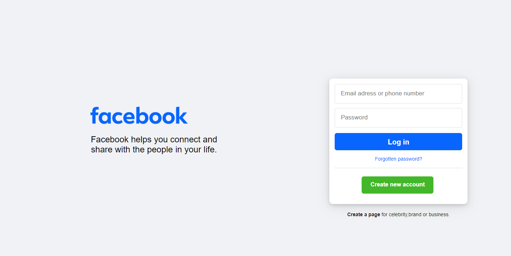
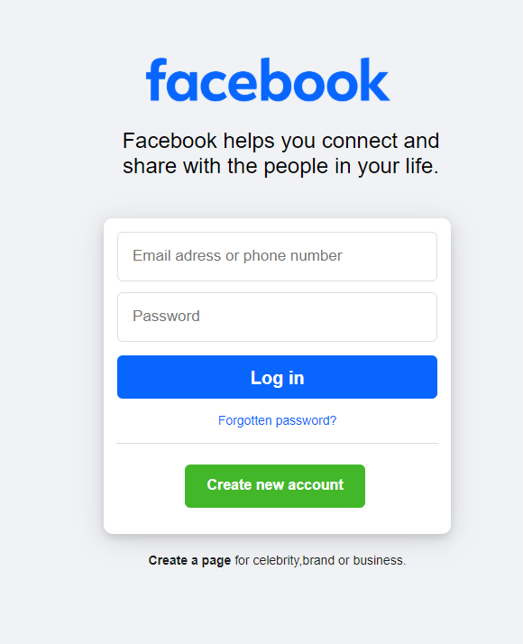

# 🌐 Facebook Login/Signup Page Clone

A visually accurate and responsive clone of Facebook's login and signup page, built **from scratch using only HTML and CSS**. This is a UI-focused project aimed at sharpening front-end development skills and replicating real-world design layouts.

 <!-- Replace with your actual image path or URL -->

---

## Features

-  Fully responsive layout
-  Pixel-perfect Facebook login/signup page clone
-  Mobile-friendly design
-  Clean, well-organized HTML & CSS codebase
-  Login and signup form sections (UI only)

---

## Built With

- HTML5
- CSS3 (Flexbox, Grid, Media Queries)
